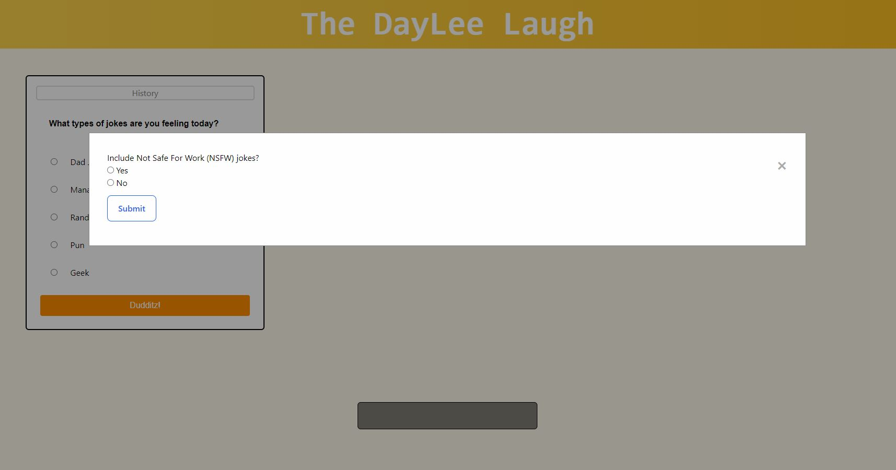
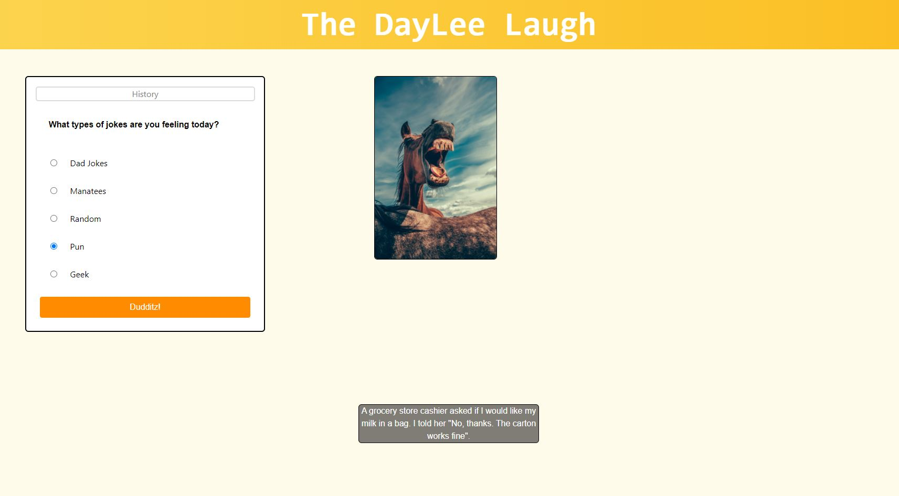
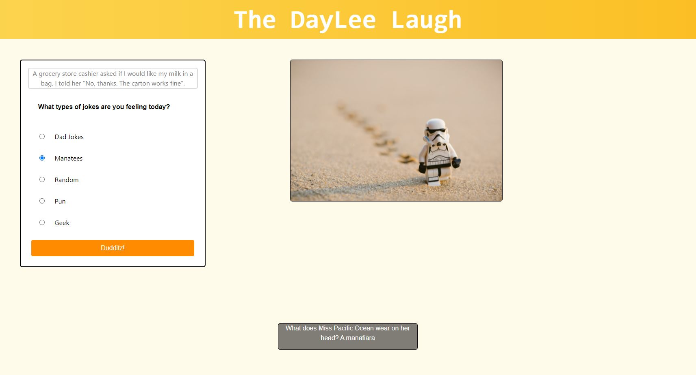
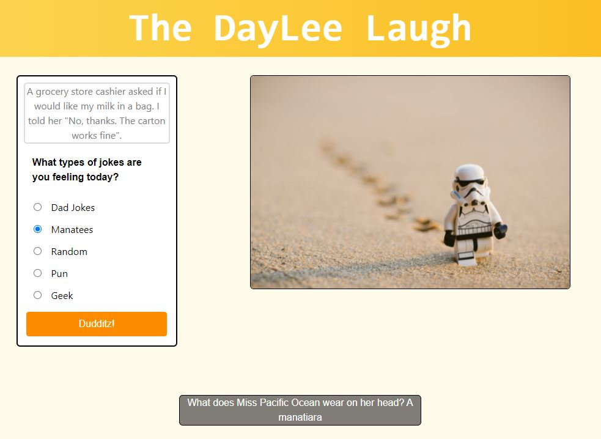
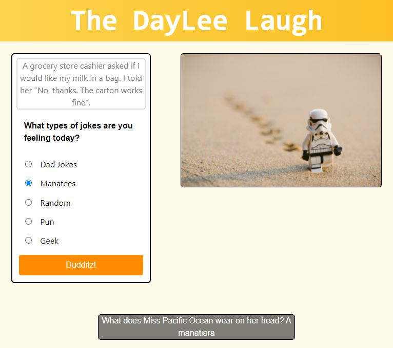
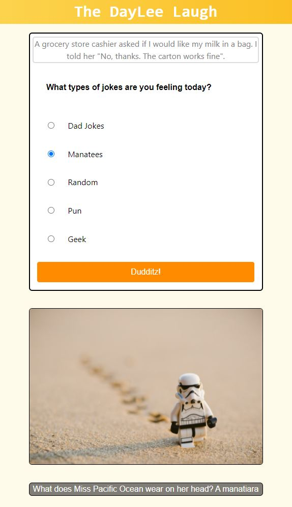

# group-project-1-the-daily-laugh

## DESCRIPTION:

Inspired by the awesomness of instructor Lee, The DailyLee Laugh is a webpage built for users looking for a good laugh. 

## USAGE:

Users can select whether or not to omit jokes not safe for work (NSFW). Users must select what joke category they would like to hear from and click the 'Dudditz' button to generate a joke and a random image to accompany it. Pressing the 'Dudditz' button also plays a sound clip of Lee saying Dudditz! As new jokes are generated, the previous joke is displayed in the history box.

Below is an image of the app upon loading, showing the NSFW input modal:

Below is an image of the app after the modal has been dismissed and user input given. The first joke and image are displayed.

Below is an image of the app after the user has requested a second joke. The first joke is now displayed in the history box, above the user input. A random image is displayed with the new joke.

The following are images of the app's responsiveness at the 992px, 768 px, and 576 px breakpoints, respectively. Until the smaller screen sizes the layout is intact, with minor changes to element sizes, as the app has a streamlined layout. Smaller screen sizes are accomodated by changing the layout for more verticality.

## THANKS:

Special thanks to our instructor Lee for giving us the rights to utilize his voice for this project.

## AUTHORS:

Anthony Zamora, Sarah Beltier, Oscar Flores, Xander Schwarz

See it in action [here](https://sbeltier.github.io/group-project-1-the-daily-laugh/)!
